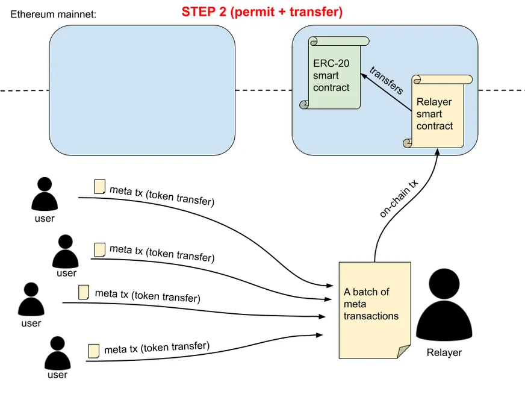

## Relayer and EIP712 Meta-Transaction

This project is for code testing by automata Network company's interview.

Project scope is design and implement a simple Relayer service that will batch user submitted transactions and submit multiple transactions in one meta-transaction.


#### Motivation

If a user have ERC20 based token owned, but he or she doesn't enough ether to transfer it. Relayer service will be useful in this situation. 

User will sign a transaction based on EIP712 standards by using Metamask. Relayer service has to verify the Signature is signed by token owner (User) or not. If those are verified, Relayer service will queue that transaction at a moment. After times up, Relayer service will bundle those transaction according to max gasLimit configuration. Then, It will forwards to Receiver smart contract. Receiver smart contract will receive the bundled transactions from Relayer and loop one by one and invoke the Target Smart contract. Target Smart contract are based on ERC20 standards. 

[ERC-20](https://eips.ethereum.org/EIPS/eip-20) tokens lies in the interplay between `approve` and `transferFrom`, which allows for tokens to not only be transferred between externally  owned accounts (EOA), but to be used in other contracts under  application specific conditions by abstracting away `msg.sender` as the defining mechanism for token access control. 

So, If we would like to transfer token on behalf of User (Token's owner), we might have approved by user as first. In this situation, EIP 2612 will be helpful. 


There are two ways of using permits:

- Sending a permit meta tx and a transfer meta tx in **two separate** on-chain txs
- Sending a permit meta tx and a transfer meta tx in **the same** on-chain tx

More often it would be better to do it in a single on-chain tx (lower tx cost), but there may be cases where two separate on-chain txs make more sense.




In this demonstration, I architecture as in following diagram. In this project I used 'Sending a permit meta tx and a transfer meta tx in **the same** on-chain tx'.


------

## Walkthrough to run the project

In this project, there are three main parts, They are

- Front End (web3 + ReactJS)
- Relayer Service (TypeScript + Postgres)
- Smart contract (Solidity)

**Front End (web3 + ReactJS)**

Frontend source is under /client folder. 

> Note that: Before you build the docker image, please copy compiled json file from  ''/artifacts/contracts/Receiver.sol/Receiver.json' to /client/src/contracts/

You can run by using docker command to build the docker file or run using `npm start`.

For docker build and run

```shell
cd client/

docker build -t rsclient:v1 .

docker run -p 127.0.0.1:8080:3000 \
-e REACT_APP_WEB3_URL=http://localhost:8545 \
-e REACT_APP_RELAYER_URL=http://localhost:5000/api/v1/relayer/transfer \
-d rsclient:v1
```

Then, you can access ``http:localhost:808`` with your local browser.

------

**Relayer Service (TypeScript + Postgres)**

Relayer service needs Postgres service. In order to run the Relayer, Postgres service need to run as first.

**Start and create database in Postgres with docker**

```shell
docker run --name postgresql-container -p 5432:5432 -e POSTGRES_PASSWORD=postgres -d postgres

# Create the database in container
docker exec -it postgresql-container bash
psql -U postgres
CREATE DATABASE relayer_sync;
```

Then, build the Relayer serice

```shell
cd relayer/

docker build -t rservice:v1 .

docker run -p 5000:5000 \
-e MAX_GAS_LIMIT=412110 \
-e TIMEOUT=10000 \
-e DB_USER=postgres \
-e DB_PASS=postgres \
-e DB_NAME=relayer_sync \
-e DB_HOST=192.168.1.2 \
-e PIRVATE_KEY=ac0974bec39a17e36ba4a6b4d238ff944bacb478cbed5efcae784d7bf4f2ff80 \
-e WEB3URL=http://127.0.0.1:8545 \
-e RECEIVER_ADDRESS=0x5FbDB2315678afecb367f032d93F642f64180aa3 \
-d rservice:v1
```

------

**Smart contract (Solidity + Development)**

I haven't deploy the contract on test network, because in these days it's difficult to get test eth on `rinkeby` test net. Because `hard-hat` is compatible with `https://www.alchemy.com/` and on alchemy, most of testnet are deprecated. 

So, let's deploy the code on local hard hat node or ganache. (I tested on both)

```shell
npx hardhat node

npx hardhat run scripts\deploy.ts --network localhost

> Receiver deployed to: 0x5FbDB2315678afecb367f032d93F642f64180aa3
> TargetContractA deployed to: 0xe7f1725E7734CE288F8367e1Bb143E90bb3F0512
> TargetContractB deployed to: 0x9fE46736679d2D9a65F0992F2272dE9f3c7fa6e0
> TargetContractC deployed to: 0xCf7Ed3AccA5a467e9e704C703E8D87F634fB0Fc9
```

------

#### Run and output

1. The `from` account will be the owner of the token. (In this case both TargetContract A,B and also C.)

2. Symbol of Target Contracts are
   1. Target contract A is TCA
   2. Target contract B is TCB
   3. Target contract C is TCC

3. As soon as running the `React-js` frontend, you must see the web screen as following.

> Make sure your connected address on metamask must own the some amount of our token (TCA, TCB, TCC).


- **Token contract address** : is for which Target contract address you would like to invoke.

- **Receiver contract address** : is receiver contract address.

- **To (Token Receiver) address**: is to input the address who are the receiver of token.

- **Amount**: how much amount want to transfer.

After you click, you will see the EIP-712 user signed box. As described as in following. EIP domain name is **Receive-interview**.


4. In `Relayer-service`, it will hold every incoming transaction according to ``TIMEOUT``config. Currently, we set `10000 ms (or) 10 secs` . If you check the `Relayer-service` you must see like this.


It will check transaction queue every timeout with transaction status `pending`.


5. After every timeout, transaction will be send to the smart contract by calculating the gas limit.

6. If transaction are having trouble to send request to smartcontract, relayer service will be mark those transactions as `ERROR`.


7. Every transaction will be count depending on mas_gas_limit.


------

**Summary**

- If you got error like `unknown account` , Please check the `PIRVATE_KEY` environment variable without `0x` perfix.
- Before you make docker file, please compile the contract and copy .json file to appropriate folder first.
- I tested on `hardhat`test node and `ganache` those contract work fine.
- I created frontend with `react-js`
- For backend `TypeScript`, `Sequelize ORM`,`Postgres`
- Smart Contract is implemented with `solidity`
- If you have any inconveniences, please let me know.

 